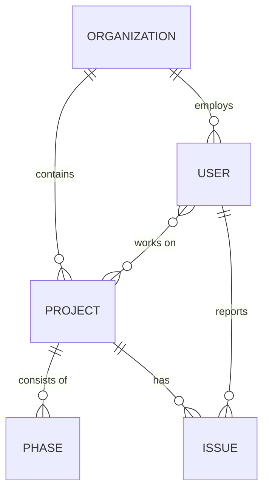

# System Architecture & Component Mapping

This document serves as a technical guide for the **Project Management Application**. It outlines the role hierarchy, data entity relationships, and dashboard connectivity to assist new developers and backend integration.

## 1. Role Hierarchy & Access Control

The system follows a top-down hierarchy where permissions cascade based on the user's role.

| Role | Access Level | Primary Responsibility |
| :--- | :--- | :--- |
| **Admin** | System-Wide | Management of all Organizations, Users, and global project oversight. |
| **Main/Co-Leader** | Organization-Wide | Management of organization-specific projects, team coordination, and issues. |
| **Frontend/Backend Lead** | Department-Wide | Specialized oversight of technical phases and department tasks. |
| **Project Lead (PL)** | Project-Specific | Focused management of specific projects and their phase lifecycles. |
| **Team Member** | Task-Specific | Execution of assigned tasks, progress updates, and reporting issues. |

---

## 2. Detailed Data Schema & Database Mappings

These schemas define the core structure of the database and how data is exchanged between the Frontend and Backend.

### A. Organization Schema
| Field | Type | Description |
| :--- | :--- | :--- |
| `id` | `UUID/String` | Unique identifier (Primary Key) |
| `name` | `String` | Organization display name |
| `orgColors` | `Object` | `{ primary: HEX, secondary: HEX }` for dynamic branding |
| `activeProjects` | `Number` | Total running projects |
| `completionRate` | `Number` | Percentage of projects finished |
| `totalRevenue` | `Number` | Lifetime financial value |

### B. Project Schema (Connected to Organization)
| Field | Type | Connectivity |
| :--- | :--- | :--- |
| `id` | `UUID/String` | Primary Key |
| `organizationId` | `UUID/String` | **Foreign Key** -> `Organization.id` |
| `name` | `String` | Project title |
| `status` | `Enum` | `running`, `completed`, `blocked`, `canceled` |
| `progress` | `Number` | 0-100 percentage |
| `deadline` | `DateTime` | Delivery date |
| `phases` | `Array[Phase]` | Collection of phase objects (see below) |

### C. Phase Schema (Nested in Project)
| Field | Type | Description |
| :--- | :--- | :--- |
| `name` | `Enum` | `UIUX`, `Frontend`, `App`, `Backend`, `Integration`, `DevOps`, `Close` |
| `status` | `Enum` | `pending`, `in_progress`, `completed` |
| `deliveryDate` | `DateTime` | Specific date for phase completion |
| `assigneeId` | `UUID/String` | **Foreign Key** -> `User.id` |

### D. User / Team Member Schema
| Field | Type | Connectivity |
| :--- | :--- | :--- |
| `id` | `UUID/String` | Primary Key |
| `organizationId` | `UUID/String` | **Foreign Key** -> `Organization.id` |
| `role` | `Enum` | Role hierarchy (Admin, Leader, Member, etc.) |
| `assignedProjects` | `Array[ID]` | **Relation** -> `Project.id` (Many-to-Many) |

### E. Issue Schema
| Field | Type | Connectivity |
| :--- | :--- | :--- |
| `id` | `UUID/String` | Primary Key |
| `projectId` | `UUID/String` | **Foreign Key** -> `Project.id` |
| `submittedBy` | `UUID/String` | **Foreign Key** -> `User.id` |
| `severity` | `Enum` | `low`, `medium`, `high`, `critical` |
| `status` | `Enum` | `open`, `in_progress`, `resolved` |

---

## 3. Schema Connectivity Diagram

---

## 4. Dashboard Connectivity Flow

### Admin Dashboard (`/admin`)
*   **Overview**: Aggregated stats from ALL organizations.
*   **Organizations**: CRUD operations for organization entities.
*   **All Projects**: Holistic view of every project in the system.
*   **Incident Reports**: High-level tracking of critical issues across all projects.

### Leader Dashboard (`/leader`)
*   **Dashboard**: Organization-specific metrics and at-risk projects.
*   **Project Management**: Detailed control over organization projects.
*   **Team Coordination**: Managing members within the organization.
*   **Activity Timeline**: Selective tracking of project phases (UI/UX -> Close).
*   **Organization Issues**: Internal blocker management.

### Team Member Dashboard (`/team`)
*   **My Workspace**: Personal metrics and daily updates.
*   **My Projects**: List of projects the user is currently assigned to.
*   **Reports & Issue**: Interface for reporting new blockers and viewing project performance.

---

## 5. Feature Flow: Project Activity Timeline & Management Hub

The Activity Timeline (`ProjectTimelineDetails.tsx`) has been upgraded to a **Project Management Hub** featuring a tabbed interface for comprehensive tracking.

### A. Timeline Tab (Delivery Roadmap)
- **Phase Sequence**: `UI/UX` -> `Frontend` -> `App` -> `Backend` -> `Integration` -> `DevOps` -> `Close`
- **Data Points**: `status` (pending | in_progress | completed), `deliveryDate`, and `assignee`.

### B. Issues Tab (Blocker Tracking)
- **Function**: Project-specific bug and blocker tracker.
- **Attributes**: `id`, `title`, `priority` (Critical to Medium), `reportedBy`, and `status` (Open | InProgress | Resolved).
- **Escalation**: Critical issues are highlighted with pulsating indicators.

### C. Reports Tab (Analytical Insights)
- **Performance**: Displays "Task Velocity" and "Daily Burnout" metrics.
- **Documentation**: Access to "Weekly Resource Reports", "Security Audits", and "Budget Summaries".

---

## 6. Dynamic Theming & Design System

The application uses a variable-based design system that allows for instant color switching.

- **Theme Engine**: Located in `src/components/ThemeSwitcher.tsx`.
- **Styling**: Controlled via `src/index.css` using the `@theme` directive and CSS variables (e.g., `--color-brand-500`).
- **Available Themes**: Indigo (Default), Emerald, Rose, Violet, Amber.
- **Implementation**: Changing the theme applies a class to `document.body` (e.g., `.theme-emerald`), which overrides the brand variables.

## 6. Common Components & Wrappers

- **CommonWrapper**: Ensures consistent container width (`max-w-[1400px]`) and centering across all public and internal pages.
- **DashboardLayout**: The primary wrapper for all authenticated routes, providing the sidebar and navigation context.
- **MetricsCard**: Used across all dashboards for standardized metric display.

## 7. Development Guidelines for Backend

1.  **Filtering**: All dashboard data (except Admin) MUST be filtered by `organizationId`.
2.  **Assignment**: Projects and Tasks should use an array-based assignment system (`assignedProjects[]`).
3.  **Audit Logs**: Every status change in the Project Activity Timeline should trigger a log entry in the global Activity Log.
4.  **Issue Escalation**: If an issue is marked as `Critical`, it should appear in both the Leader's `Organization Issues` and Admin's `Incident Reports`.
