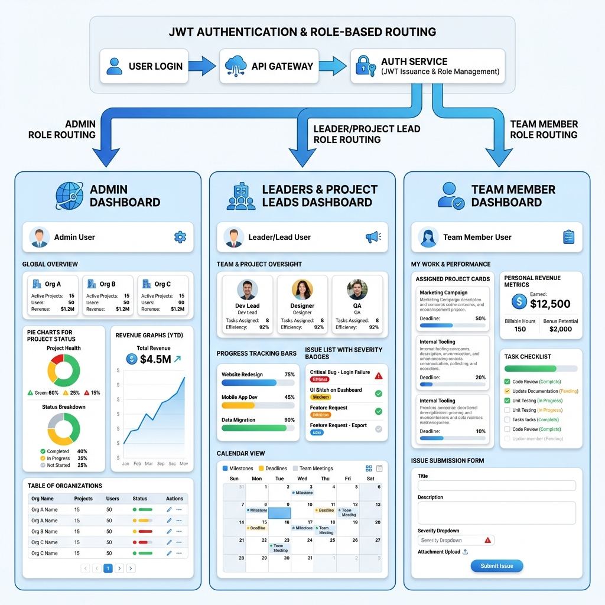
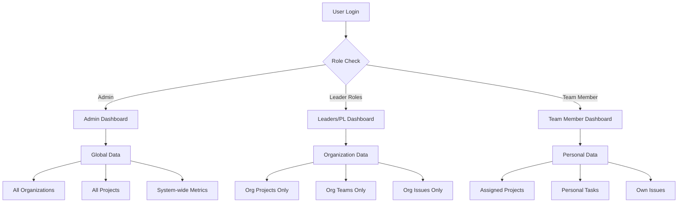
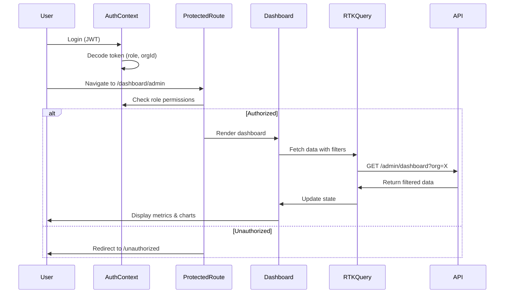

# Project Management Dashboard - Project Overview

## Executive Summary

A comprehensive role-based dashboard system for project management built with React TypeScript, featuring three distinct dashboard types with strict role-based access control and organization-scoped data isolation.

## Visual Architecture



The diagram above illustrates the three-tier dashboard system with JWT-based authentication and role-based routing. Each dashboard type has distinct components and data scopes tailored to user roles.


## System Architecture

### Three-Tier Dashboard Approach



### Role Hierarchy

```typescript
Admin (Global Access)
├── View all organizations
├── View all projects
└── Access system-wide revenue

Leaders & Project Leads (Organization-Scoped)
├── Main Leader
├── Co-Leader
├── Frontend Leader
├── Backend Leader
└── Project Lead
    ├── View organization projects
    ├── Manage teams
    └── Access org revenue

Team Members (Project-Scoped)
├── View assigned projects only
├── Track personal contributions
└── Submit and track issues
```

## Core Features by Dashboard

### 1. Admin Dashboard
**Scope:** Global system oversight

**Key Metrics:**
- Total organizations count
- Total projects (completed vs running)
- Monthly delivery value (cross-organization)
- System-wide issue tracking

**Components:**
- Organization performance comparison table
- Project status distribution (pie chart)
- Revenue trends (bar/line charts)
- Blocked projects alert system
- Global issues management

**Filters:**
- Organization selector
- Project selector
- Date range picker

---

### 2. Leaders & Project Leads Dashboard (Shared)
**Scope:** Organization-level management

**Key Metrics:**
- Running projects count with average progress
- Organization monthly delivery value
- At-risk projects (delays > 20%)
- Upcoming deadlines (next 7 days)

**Components:**
- Assigned teams and members directory
- Daily progress updates feed
- Issue management (sorted by severity)
- Deadline calendar view
- Project health indicators

**Filters:**
- Project selector (within org)
- Date range picker
- Team member selector

---

### 3. Team Member Dashboard
**Scope:** Personal accountability and tasks

**Key Metrics:**
- Personal monthly revenue contribution
- Number of assigned projects
- Task completion rates
- Submitted issues count

**Components:**
- Assigned projects list with deadlines
- Progress tracker per project
- Issue submission form
- Issue status tracker
- Task-specific files and delivery plans

**Filters:**
- Project selector (assigned only)

---

## Technical Architecture

### Frontend Stack

```
React 19 + TypeScript 5.7
├── State Management: Redux Toolkit + RTK Query
├── Routing: React Router DOM v7
├── Styling: Tailwind CSS v4
├── UI Components: Radix UI
├── Animations: Framer Motion
├── Forms: React Hook Form + Zod
├── Charts: Recharts
└── HTTP: Axios with interceptors
```

### Component Architecture

```
App
├── AuthProvider (Global context)
│   ├── JWT token management
│   ├── Role validation
│   └── Auto-logout on expiry
│
├── Public Routes
│   ├── Home
│   ├── About
│   └── Contact
│
└── Protected Routes (Dashboard)
    ├── DashboardLayout
    │   ├── Sidebar (role-based nav)
    │   └── Header (user info, logout)
    │
    ├── Admin Dashboard (Admin only)
    │   ├── Global Metrics
    │   ├── Org Performance Table
    │   ├── Charts (Status, Revenue)
    │   └── Filters
    │
    ├── Leaders Dashboard (5 leader roles)
    │   ├── Org Metrics
    │   ├── Team Directory
    │   ├── Progress Feed
    │   ├── Issue Management
    │   └── Deadline Calendar
    │
    └── Team Member Dashboard (Team Member only)
        ├── Personal Metrics
        ├── Assigned Projects
        ├── Issue Submission
        └── Task Tracker
```

### Data Flow Pattern



### State Management Strategy

**Redux Store Structure:**

```typescript
store
├── adminDashboardApi (RTK Query)
│   └── endpoints: getAdminDashboard
│
├── leadersDashboardApi (RTK Query)
│   └── endpoints: getLeadersDashboard
│
├── teamMemberDashboardApi (RTK Query)
│   └── endpoints: getTeamMemberDashboard
│
└── authSlice (Redux Toolkit)
    ├── state: user, token, isAuthenticated
    └── actions: login, logout, updateUser
```

**Data Fetching Pattern:**
- Use RTK Query for automatic caching and invalidation
- Implement optimistic updates for issue submission
- Cache dashboard data for 5 minutes
- Refetch on filter changes

---

## Security Considerations

### Authentication & Authorization

1. **JWT-Based Auth:**
   - Token stored in localStorage
   - Contains: `{ userId, email, role, organizationId, exp }`
   - Auto-logout on expiration

2. **Role-Based Access Control:**
   - Frontend enforces UI restrictions
   - Backend must validate ALL requests
   - No sensitive data in frontend state

3. **Data Isolation:**
   - Leaders can NEVER see other organization data
   - Team members can NEVER see unassigned projects
   - Admin is the ONLY global role

4. **API Security:**
   ```typescript
   // Every API request includes:
   headers: {
     Authorization: `Bearer ${token}`,
     'X-Organization-ID': organizationId // for double-check
   }
   ```

### Access Control Matrix

| Role | Admin Dashboard | Leaders Dashboard | Team Dashboard |
|------|----------------|-------------------|----------------|
| Admin | ✅ Full Access | ❌ No Access | ❌ No Access |
| Main Leader | ❌ No Access | ✅ Org-Scoped | ❌ No Access |
| Co-Leader | ❌ No Access | ✅ Org-Scoped | ❌ No Access |
| Frontend Leader | ❌ No Access | ✅ Org-Scoped | ❌ No Access |
| Backend Leader | ❌ No Access | ✅ Org-Scoped | ❌ No Access |
| Project Lead | ❌ No Access | ✅ Org-Scoped | ❌ No Access |
| Team Member | ❌ No Access | ❌ No Access | ✅ Personal |

---

## Key Design Decisions

### 1. Shared Dashboard for All Leader Roles
**Rationale:** All five leader roles (Main, Co, Frontend, Backend, Project Lead) have identical data needs and scopes. A single dashboard eliminates code duplication and simplifies maintenance.

### 2. Organization-Scoped Data Architecture
**Rationale:** Multi-tenancy requires strict data isolation. Each API call includes organization context automatically via JWT, preventing accidental data leakage.

### 3. RTK Query for Data Fetching
**Rationale:** Built-in caching, automatic refetching, and loading states reduce boilerplate and improve UX with instant navigation.

### 4. Component-First Approach
**Rationale:** Building reusable components (MetricCard, DataTable, FilterPanel) first ensures consistency across all three dashboards and speeds up development.

### 5. Recharts for Visualization
**Rationale:** React-native charting with excellent TypeScript support and built-in responsiveness. Easy to customize and animate.

---

## Development Roadmap

### Week 1: Foundation
- [ ] TypeScript type definitions
- [ ] Authentication context implementation
- [ ] Protected routing setup
- [ ] Redux store configuration
- [ ] API service layer with interceptors

**Deliverable:** Working auth flow with role-based route protection

---

### Week 2: Core Components
- [ ] MetricCard component
- [ ] DataTable with sorting and filtering
- [ ] FilterPanel with multi-select
- [ ] Chart components (Pie, Bar, Line)
- [ ] Dashboard layouts

**Deliverable:** Reusable component library

---

### Week 3: Dashboard Implementation
- [ ] Admin Dashboard
  - Global metrics
  - Organization performance table
  - Project status charts
  - Issue tracking
  - Filters
  
- [ ] Leaders Dashboard
  - Org metrics
  - Team directory
  - Progress feed
  - Issue management
  - Deadline calendar
  
- [ ] Team Member Dashboard
  - Personal metrics
  - Assigned projects
  - Issue submission
  - Task tracking

**Deliverable:** Three fully functional dashboards

---

### Week 4: Integration & Polish
- [ ] API integration
- [ ] Error handling and loading states
- [ ] Responsive design refinement
- [ ] Performance optimization
- [ ] Accessibility improvements
- [ ] Unit and integration tests
- [ ] Documentation

**Deliverable:** Production-ready dashboard system

---

## File & Folder Structure

```
src/
├── components/
│   ├── Dashboard/
│   │   ├── MetricCard.tsx         # Reusable KPI card
│   │   ├── DataTable.tsx          # Sortable data table
│   │   ├── FilterPanel.tsx        # Multi-filter component
│   │   ├── ChartComponents.tsx    # Pie, Bar, Line charts
│   │   ├── IssueForm.tsx          # Issue submission
│   │   └── ProgressFeed.tsx       # Daily updates feed
│   ├── ProtectedRoute.tsx         # Role-based route guard
│   └── ui/                        # Radix UI wrappers
│
├── pages/
│   └── Dashboard/
│       ├── AdminDashboard.tsx     # Global admin view
│       ├── LeadersDashboard.tsx   # Org-level leader view
│       └── TeamMemberDashboard.tsx # Personal member view
│
├── contexts/
│   └── AuthContext.tsx            # JWT auth & role management
│
├── store/
│   ├── Api/
│   │   ├── adminDashboardApi.ts   # Admin RTK Query
│   │   ├── leadersDashboardApi.ts # Leaders RTK Query
│   │   └── teamMemberDashboardApi.ts # Member RTK Query
│   ├── Slices/
│   │   └── authSlice.ts           # Auth state slice
│   └── index.ts                   # Store configuration
│
├── types/
│   ├── dashboard.types.ts         # Dashboard data types
│   └── ApiTypes/
│       └── dashboard.api.types.ts # API response types
│
├── routes/
│   ├── DashboardRoutes.tsx        # Protected dashboard routes
│   └── PublicRoutes.tsx           # Existing public routes
│
├── Layout/
│   ├── DashboardLayout/
│   │   ├── DashboardLayout.tsx    # Main dashboard wrapper
│   │   ├── DashboardHeader.tsx    # Top nav with user menu
│   │   └── DashboardSidebar.tsx   # Side navigation
│   └── PublicLayout/              # Existing public layout
│
└── utils/
    ├── roleUtils.ts               # Role checking helpers
    ├── dateUtils.ts               # Date formatting
    └── chartUtils.ts              # Chart data transformers
```

---

## API Endpoints (Backend Requirements)

### Authentication
```typescript
POST /api/auth/login
Body: { email: string, password: string }
Response: { token: string, user: { id, email, role, organizationId? } }
```

### Admin Dashboard
```typescript
GET /api/admin/dashboard?organizationId=&projectId=&startDate=&endDate=
Headers: { Authorization: Bearer <token> }
Response: AdminDashboardData
```

### Leaders Dashboard
```typescript
GET /api/leaders/dashboard?projectId=&startDate=&endDate=&teamMemberId=
Headers: { Authorization: Bearer <token> }
Response: LeadersDashboardData (filtered by user's organizationId from JWT)
```

### Team Member Dashboard
```typescript
GET /api/team/dashboard?projectId=
Headers: { Authorization: Bearer <token> }
Response: TeamMemberDashboardData (filtered by user's id from JWT)
```

### Issue Submission
```typescript
POST /api/issues
Headers: { Authorization: Bearer <token> }
Body: { projectId, severity, description }
Response: { id, status, createdAt }
```

---

## Performance Targets

- **Initial Load:** < 2 seconds
- **Dashboard Switch:** < 500ms (with RTK Query cache)
- **Filter Application:** < 100ms
- **Chart Rendering:** < 300ms
- **Lighthouse Score:** > 90

---

## Accessibility Goals

- **WCAG 2.1 AA Compliance**
- Keyboard navigation for all interactive elements
- Screen reader support with ARIA labels
- High contrast mode support
- Focus indicators on all focusable elements

---

## Testing Strategy

### Unit Tests
- Component rendering
- Filter logic
- Role validation
- Data transformation utilities

### Integration Tests
- Auth flow (login → dashboard access)
- Dashboard data fetching
- Filter interactions
- Chart data updates

### E2E Tests (Recommended)
- Full user journeys per role
- Cross-browser testing
- Mobile responsiveness

---

## Environment Setup

```bash
# 1. Install dependencies
npm install

# 2. Install additional packages
npm install recharts date-fns
npm install @radix-ui/react-select @radix-ui/react-dialog @radix-ui/react-tabs

# 3. Create .env file
echo "VITE_API_BASE_URL=http://localhost:5000/api" > .env

# 4. Run development server
npm run dev
```

---

## Next Steps

1. **Review this plan** - Confirm architecture and approach
2. **Backend coordination** - Ensure API endpoints align
3. **Design review** - Confirm UI/UX approach
4. **Begin Phase 1** - Set up types and authentication
5. **Iterate weekly** - Review progress and adjust

---

## Success Metrics

- ✅ All three dashboards functional with role-based access
- ✅ Zero cross-organization data leakage
- ✅ Sub-2-second dashboard load times
- ✅ Full TypeScript type coverage
- ✅ Responsive design across all devices
- ✅ WCAG AA accessibility compliance
- ✅ 80%+ test coverage

---

## Questions for Stakeholders

1. **Backend Status:** Is the backend API already implemented, or should this be coordinated?
2. **Design System:** Are there existing brand colors/fonts to use, or create new design tokens?
3. **Deployment:** What environment will this be deployed to (Vercel, AWS, etc.)?
4. **User Testing:** Will there be a beta testing phase with real users?
5. **Timeline:** Is the 4-week roadmap acceptable, or is there a hard deadline?

---

*This overview provides a comprehensive blueprint for building a production-grade, role-based Project Management Dashboard system with React TypeScript.*
